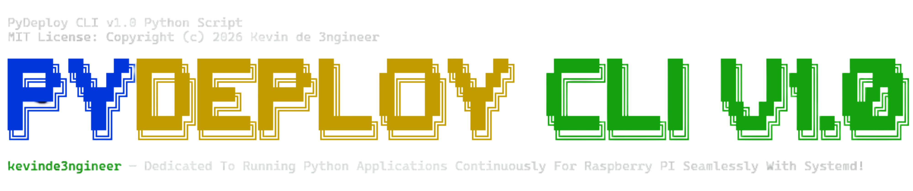

#


<p align="center">
  <a href="https://discord.gg/uqmDfXAZe"></a>
  <a href="LICENSE"></a>
  <a href="https://github.com/kevinde3ngineer/PyDeployCLI-v1.0"></a>
  <a href="https://github.com/kevinde3ngineer/PyDeployCLI-v1.0/blob/RELEASE.md"></a>
</p>

PyDeploy is a Terminal CLI that is automated to turn a Python script from a GitHub Repository into a `systemd` service on your Raspberry Pi, allowing it to run continously while providing tools to monitor its status and view logs.

Built for one job, PyDeploy CLI is dedicated to running Python applications continuously for Raspberry PI seamlessly with `Systemd`. No more manual `venv` setup, no hand-written unit files, and no more memorizing `systemctl` flags. My official support and recommendation channel is my Discord server. Give this repo a `star` to support my work!

## Features
- Auto-installs missing dependencies; checks for `git`, `pip3`, and `venv`, and installs them if missing
- Clones your repo and sets up a virtual environment automatically
- Generates a `systemd` unit file for your chosen Python file
- Built-in control panel to enable, start, stop, disable, restart, and monitor your service
- Live status indicator (🟢/🔴) and streaming logs via `journalctl`

## Requirements
- Raspberry Pi OS (or any Debian-based Linux distro) running `systemd`
- Internet access (for cloning repos and installing dependencies)
- Python 3.x

## Installation
Option A - Clone It Yourself:

> No dependencies are required to be installed ahead of time beyond `git` and `python3`; PyDeploy checks for and installs `pip3` and `venv` itself if they're missing.
```bash
git clone https://github.com/kevinde3ngineer/PyDeployCLI-v1.0.git
cd PyDeployCLI-v1.0
sudo python3 PyDeployCLI.py
```

<br>

Option B - One-Line Install:

> Always safe to read `install.sh` before piping it to `bash`; that's true of any one-line installer, not just this one. Always `curl` again when PyDeploy updates!
```bash
curl -fsSL https://raw.githubusercontent.com/kevinde3ngineer/PyDeployCLI-v1.0/main/install.sh | bash
```

> Run PyDeploy CLI using the following command:
```bash
sudo pydeploy
```

## Usage
Run the script and you will be prompted with the main menu:
```bash
PyDepoy CLI v.1.0 - kevinde3ngineer
Select An Option:

[1] Control Panel
[2] Set Up
```

<br>

Control Panel [1]
> Once a service exists, manage it from here:
```bash
Status: Currently Unobtainable
Select A Control:
        # CONTROL
        [1] --  Enable  -- startup on boot
        [2] --  Start   -- start service
        [3] --  Disable -- disable start on boot
        [4] --  Stop    -- disable service
        [5] --  Restart -- restart service

        # VIEW
        [6] --  Status  -- full report
        [7] --  Logs    -- live output

        # QUIT
        [Q] --  Quit    -- exit control panel
```
> A live status indicator (🟢 running / 🔴 not running) refreshes automatically in the background while you're in the menu (note: when you first enter the control panel the status will be `Currently Unobtainable`; run a command to reload the status).

<br>

Set Up [2]
> Walks You Through:
>- Checking/installing `git`, `pip3`, `venv`
>- Entering a GitHub repo URL (HTTPS)
>- Authenticating with a token if the repo is private
>- Cloning the repo and creating a virtual environment
>- Installing `requirements.txt` if present
>- Selecting which `.py` file to run
>- Naming and generating a systemd service file
>- Optionally enabling on boot and starting the service immediately

## Known Limitations
- Assumes a Debian/systemd-based OS (not tested on other distros)
- Assumes the repo is cloned into your home directory `~`; running from a different working directory during setup may cause path mismatches
- Every control-panel action calls `sudo`, so passwordless sudo is strongly recommended to avoid repeated password prompts or hangs
- Only tested on Raspberry Pi OS (Debian Trixie)
- Personal access tokens are passed as command-line arguments to `git`, which may be briefly visible to other local users via process listings `ps aux`

## Note From Dev
Thank you for checking out my project, PyDeploy. This was a passion project focused on improving my Python skills while building a way to deploy, run, and monitor Python applications on a Raspberry Pi. PyDeploy CLI's current release is v1.1.

I’ll likely release a more polished v2.0 in the future, so stay tuned. If you have any questions, contact me on my Discord Server.


